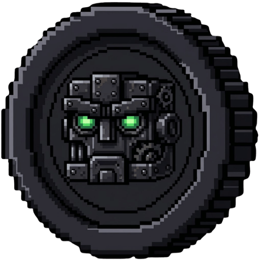
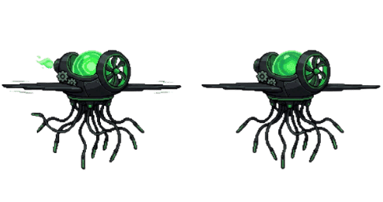
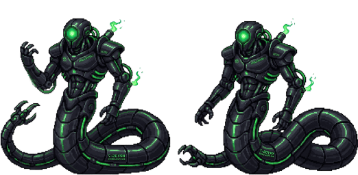
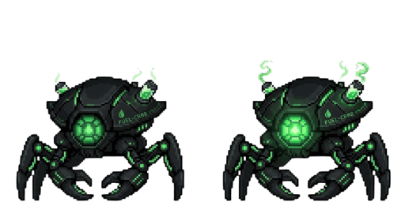
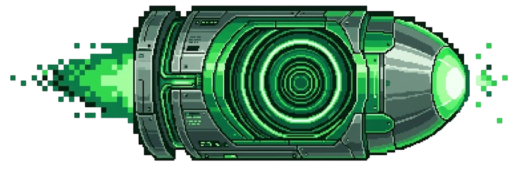

# BLOCK FUEL: Punch and Run

  

A fast-paced cyberpunk 2D action runner built with **Next.js**, **React**, and **HTML Canvas**. Dodge hazards, jump over ground drones, slide under floating jellyfish, punch cyber enemies, and harvest Fuel Coins as you sprint endlessly across the neon grid!

---

## ⚡ Gameplay

You control the **Runner**, who sprints through the neon city grid. Survive as long as possible by dodging obstacles, neutralizing cyber drones with power punches, and collecting Fuel Coins.

### Controls

| Action | Keyboard | Mouse / Touch |
|--------|----------|---------------|
| **Jump** | `W` / `Arrow Up` / `Space` | Touch Jump Button (▲) |
| **Duck / Slide** | `S` / `Arrow Down` | Touch Duck Button (▼) |
| **Power Punch** | `D` / `Arrow Right` | Click Canvas / Touch Punch (🥊) (Costs 1 Fuel Coin) |
| **Start / Reboot** | Any key | Tap Screen / Click Reboot Button |

### Scoring & Multipliers

| Action | Points | Notes |
|--------|--------|-------|
| Dodge an obstacle (duck or jump) | **+1** | Standard avoidance |
| Punch a **Scrap-Mite** | **+2** | Costs 1 Fuel Coin |
| Punch an **Aero-Jelly** | **+3** | Costs 1 Fuel Coin |
| Punch a **Hollow Stalker** | **+4** | Costs 1 Fuel Coin |

### Cyber Obstacles & Drones

| Sprite | Name | Description |
|--------|------|-------------|
|  | **Aero-Jelly** | Floating cyber aerial drone. Duck/slide under it or punch it for +3 pts. |
|  | **Hollow Stalker** | Tall cyber heavyweight stalker. High threat, punch for +4 pts. |
|  | **Scrap-Mite** | Low ground crawler drone. Must be jumped over or punched for +2 pts. |

### Bullets & Plasma Hazards

Drones fire energy projectiles at random intervals:

| Projectile | Image | Damage | Notes |
|------------|-------|--------|-------|
| **Crystal KO-Beam** |  | **-50 HP** | Heavy plasma blast, lethal danger |
| **Nano Dart** |  | **-25 HP** | Rapid pulse dart |

*Note: Bullets cannot be punched — duck or jump to avoid them!*

### Health & Reactor Auto-Regen

- **100 HP** total health pool.
- Health auto-regenerates over time back to 100%.
- Dynamic status color: **Neon Green** (>50%), **Amber** (25-50%), **Crimson Flash** (<25%).

### ⚡ Fuel Coins

- Fuel coins appear across the grid at reachable heights.
- Each collected coin fuels **1 Power Punch** (1 coin = 1 punch).
- Punches destroy cyber drones on contact and award bonus points.

---

## 🛠 Tech Stack

- **Framework**: Next.js (App Router)
- **Styling**: Tailwind CSS & Vanilla Cyberpunk CSS Tokens
- **Rendering**: HTML5 Canvas (2D context) with Delta-time 60 FPS Game Loop
- **Icons & Favicon**: SVG Vector Neon Fuel Flame (`icon.svg`) & Block Coin (`coin.png`)
